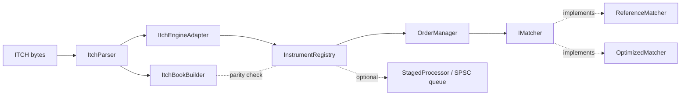

# Titan-Engine

A C++20 limit-order-book exchange and matching engine: price-time-priority
matching behind a common interface, ITCH 5.0 market-data ingestion (file and
TCP), and a thin backtesting layer on top. Two matcher implementations
share one contract — `ReferenceMatcher`, a deliberately simple correctness
oracle, and `OptimizedMatcher`, a pooled/tombstoned implementation checked
against it on every parity, fuzz, and ITCH-replay test.

## Prerequisites

- CMake 3.20+
- A C++20 compiler (Apple Clang, GCC, or Clang on Linux)
- Internet access on first configure (Google Test and Google Benchmark are fetched via `FetchContent`)

## Build and test

```
rm -rf build && cmake -S . -B build && cmake --build build
cd build && ctest --output-on-failure
```

or, using the Makefile wrapper:

```
make test
```

This builds in a debug-equivalent configuration (no `-O` flags) by default.

## Optional Release benchmark profile

```
cmake -S . -B build-rel -DTITAN_BENCHMARK_RELEASE=ON && cmake --build build-rel
```

Applies `-O2 -DNDEBUG` to the benchmark binaries and their direct library
dependencies only — the default build above is unaffected. See
`docs/benchmark-results/environment.md` for details and measured numbers.

## Tools

| Tool | Purpose | Example |
|---|---|---|
| `replay_engine` | Replay an ITCH file and check engine-vs-feed parity | `build/tools/replay_engine tests/fixtures/itch/sample_session.itch --matcher optimized` |
| `itch_listen` | Connect as a TCP client and replay a live ITCH-framed byte stream | `build/tools/itch_listen --host 127.0.0.1 --port 9000 --matcher optimized` |
| `itch_dump` | Decode an ITCH file and print a per-message-type count | `build/tools/itch_dump tests/fixtures/itch/sample_session.itch` |
| `itch_replay` | Replay an ITCH file through the feed-side book builder and print top-of-book | `build/tools/itch_replay tests/fixtures/itch/sample_session.itch` |
| `backtest_run` | Replay an ITCH file and report fill/reject/trade-volume metrics | `build/tools/backtest_run tests/fixtures/itch/sample_session.itch --matcher optimized` |

## Architecture



`InstrumentRegistry` picks `ReferenceMatcher` or `OptimizedMatcher` per
instance. ITCH bytes reach it either through a one-shot file replay or a
streaming TCP client; a background SPSC pipeline can drive it from a
separate consumer thread instead of the calling thread. See
`docs/architecture.md` for the full library breakdown.

## Further reading

- [`docs/architecture.md`](docs/architecture.md) — library layout and data flow
- [`docs/itch-notes.md`](docs/itch-notes.md) — ITCH wire format, parser/book-builder/replay/TCP-feed notes and known limits
- [`docs/backtest-notes.md`](docs/backtest-notes.md) — `backtest_run` vs `replay_engine`, strategy hook scope
- [`docs/benchmark-results/`](docs/benchmark-results/) — measured throughput/latency/allocation numbers, environment, and how to reproduce them
