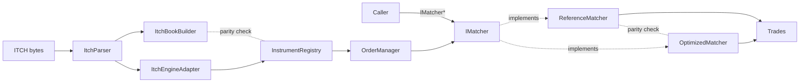

# titan-engine architecture

A single-process C++20 exchange: order matching, ITCH market-data ingestion
(file and TCP), and a thin backtesting layer, all built as small static
libraries behind a few narrow interfaces.

## Libraries

| Library | Purpose |
|---|---|
| `titan_reference` | `ReferenceMatcher` — the correctness oracle. Simple `std::map` + `std::list` + `std::unordered_map`; never optimized. |
| `titan_optimized` | `OptimizedMatcher` — same `IMatcher` contract, pooled order storage, tombstoned price levels. Parity-tested against `ReferenceMatcher`. |
| `titan_exchange` | `OrderManager` (validation, lifecycle, self-trade prevention) and `InstrumentRegistry` (per-symbol matcher + event log). |
| `titan_book` | Cross-cutting book invariants checked against both matchers. |
| `titan_market_data` | `EventPublisher` — derives `ExecutionReport`s from `InstrumentRegistry`'s event log. |
| `titan_itch` | ITCH 5.0 framing/decoding (`ItchParser`) and feed-side book reconstruction (`ItchBookBuilder`). |
| `titan_replay` | `ItchEngineAdapter` + `ParityChecker` + `EventReplayer` — drives `InstrumentRegistry` from decoded ITCH and checks it against `ItchBookBuilder`. |
| `titan_pipeline` | Lock-free SPSC ring buffer + `StagedProcessor` — a background consumer thread driving `InstrumentRegistry`. |
| `titan_feed_tcp` | `SocketFeedReader` + `ItchSocketPipeline` — TCP client ingestion of ITCH-framed bytes, wired into the same replay/adapter path as file replay. |
| `titan_backtest` | `BacktestRunner` — file-replay metrics (fills, rejects, trade volume, final book) plus an optional strategy callback hook. |
| `titan_platform` | Thread pinning (`pinThread`/`pinCurrentThreadToCpu`), Linux-only with no-op fallbacks elsewhere. |
| `titan_bench` | Latency histogram, benchmark harness, and scenario loader shared by `benchmarks/`. |

## Data flow

```
ITCH bytes (file or TCP)
    │
    ▼
ItchParser  (framing + decode)
    │
    ├──▶ ItchBookBuilder      (feed-side oracle book, for parity checks)
    │
    └──▶ ItchEngineAdapter ──▶ InstrumentRegistry ──▶ OrderManager ──▶ IMatcher
```

`IMatcher` is the matching contract (`addOrder`, `cancelOrder`, `matchOrder`,
`bestBid`/`bestAsk`, `bidDepth`/`askDepth`). `ReferenceMatcher` implements it
as the correctness oracle; `OptimizedMatcher` implements the same contract
and is checked against the reference on every parity/fuzz/ITCH-replay test.
`InstrumentRegistry` picks one or the other per instance via `MatcherBackend`.



Two independent ingestion paths feed the same `ItchEngineAdapter`: a
one-shot file replay (`EventReplayer`) and a streaming TCP client
(`SocketFeedReader` / `ItchSocketPipeline`). Both produce the same book
state for the same byte stream. A separate SPSC pipeline (`StagedProcessor`)
can drive `InstrumentRegistry` from a background consumer thread instead of
the calling thread, decoupling ingestion from matching.

## Repo layout

```
titan-engine/
├── include/titan/     # public headers, mirrors src/ by subsystem
├── src/                # library implementations
├── reference/          # ReferenceMatcher — the correctness oracle, kept apart deliberately
├── tools/               # CLIs: replay_engine, itch_listen, itch_dump, itch_replay, backtest_run
├── benchmarks/          # Google Benchmark executables + scenario files
├── tests/               # unit, integration, parity, and fuzz tests (CTest)
├── docs/                # this file, ITCH notes, backtest notes, benchmark results
└── .github/workflows/   # CI
```
