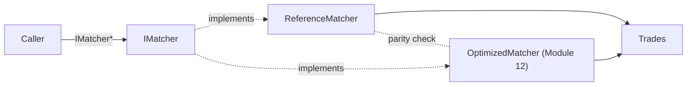

# Titan-engine Architecture (Module 1 snapshot)

## Current state

Single-symbol reference matching engine, restructured behind an interface
so later modules can add an optimized implementation without touching
callers.

- `titan_reference` (static lib) — `ReferenceMatcher`, implements `IMatcher`.
  Simple `std::map` (price levels) + `std::list` (FIFO per level) +
  `std::unordered_map` (order lookup for O(1) cancel). This is the
  correctness oracle for everything downstream — not optimized, not touched
  once behavior is locked in by tests.
- `IMatcher` (`include/titan/book/i_matcher.hpp`) — the contract:
  `addOrder`, `cancelOrder`, `matchOrder`, `bestBid`, `bestAsk`. Both the
  reference and, eventually, the optimized matcher implement this so
  callers and parity tests can swap implementations behind a pointer.
- Shared types (`Order`, `Trade`, `Side`, `OrderId`, `Price`, `Quantity`,
  `PriceLevels`, `OrderLocation`) live in `include/titan/core/types.hpp`,
  namespace `titan`.



## Repo layout

```
titan-engine/
├── include/titan/
│   ├── core/types.hpp       # Order, Trade, Side, Price, ...
│   └── book/i_matcher.hpp   # IMatcher interface
├── reference/
│   ├── order_book.hpp       # ReferenceMatcher : IMatcher
│   └── order_book.cpp
├── tests/
│   ├── CMakeLists.txt
│   └── unit/test_reference_matcher.cpp
├── benchmarks/               # stub; Module 8 adds real benchmarks
├── docs/
│   ├── architecture.md       # this file
│   └── benchmark-results/    # versioned baselines, populated from Module 8
└── .github/workflows/ci.yml
```

## Planned modules

Order types & lifecycle -> market/IOC orders -> cancel/replace & STP ->
invariants/fuzzing -> multi-symbol & events -> execution reports & market
data -> benchmark harness -> ITCH parser -> ITCH book reconstruction ->
historical replay -> optimized matcher (parity-tested against
`ReferenceMatcher`) -> memory/cache optimization -> lock-free pipeline ->
low-latency tuning -> socket feed handler -> (optional) tick storage,
backtesting, AF_XDP.

Full detail lives in the project roadmap (module-by-module goals,
components, tests, benchmarks, definition of done).
